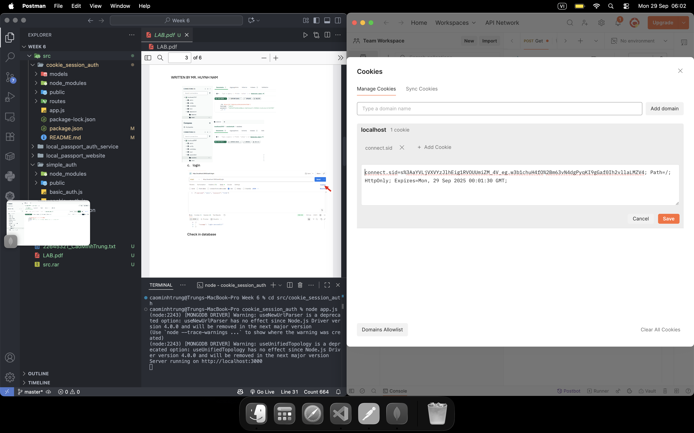
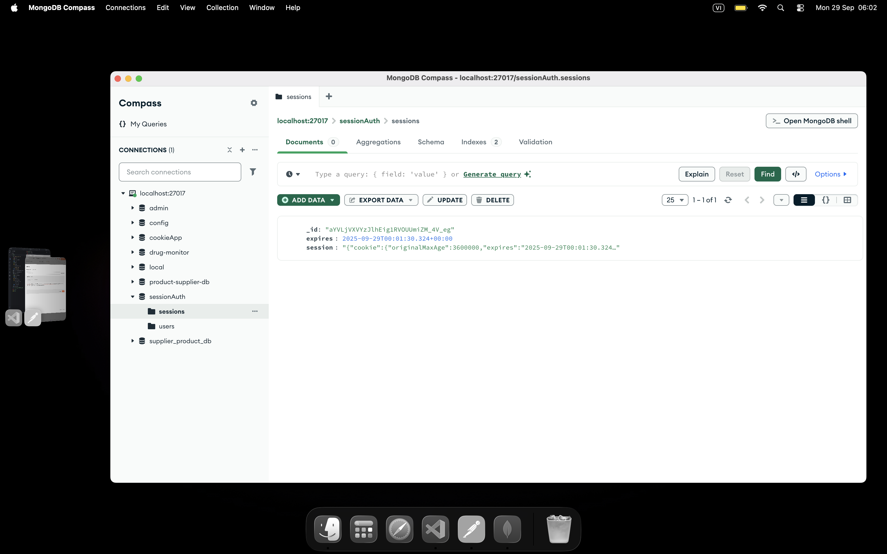
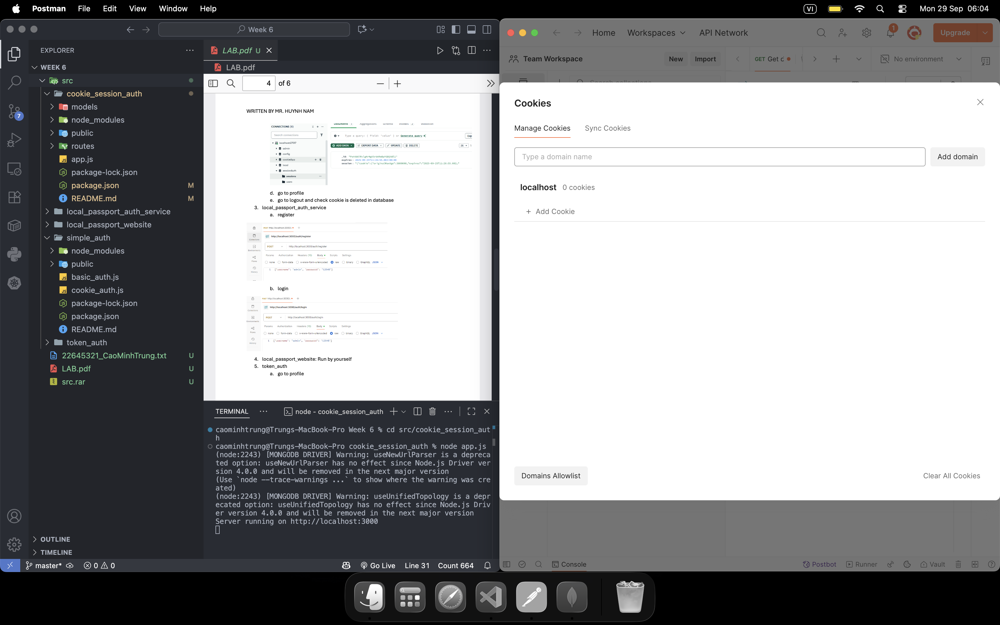
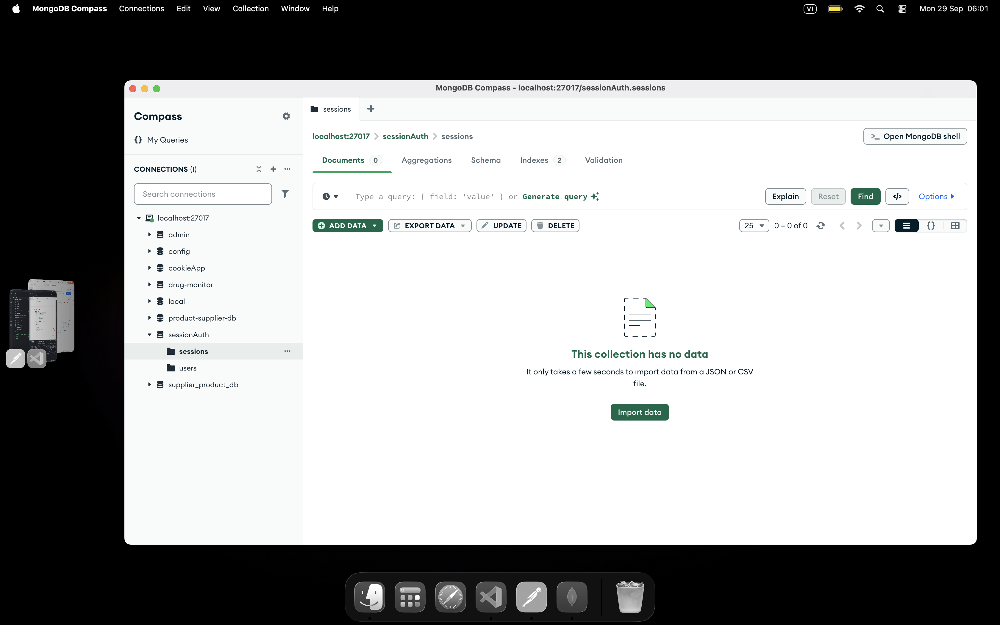
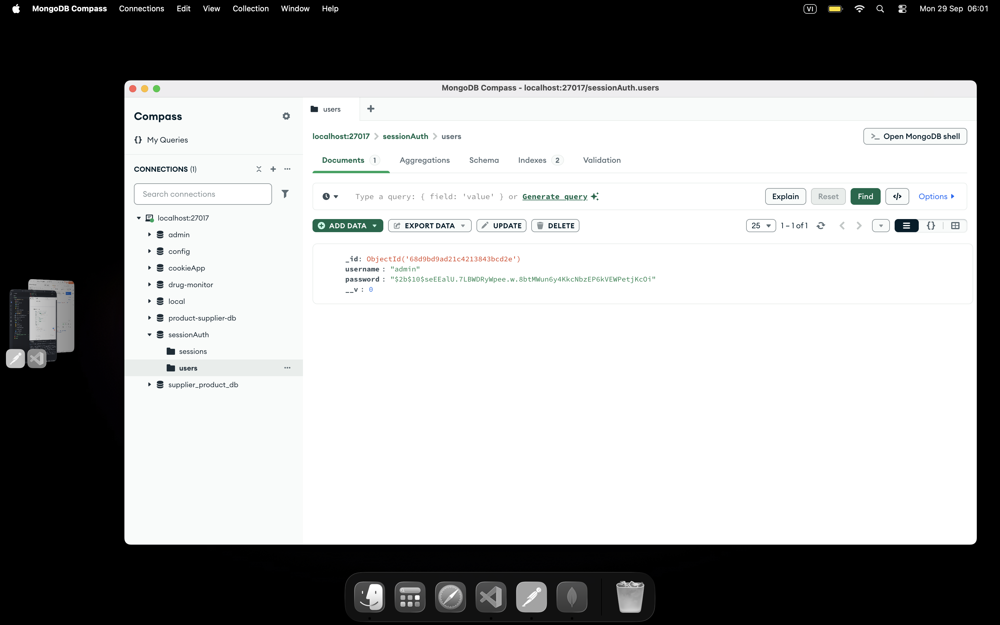
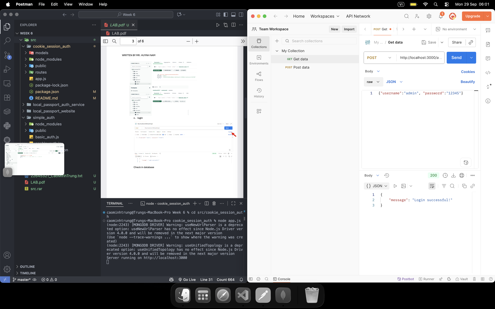
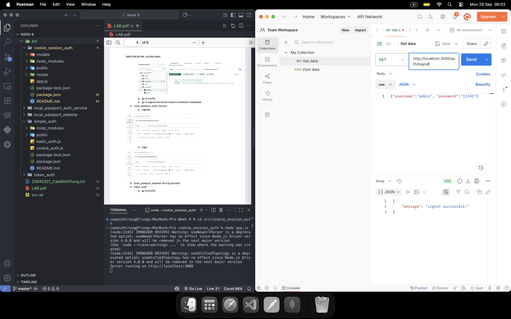

# Cookie Session Auth

This project demonstrates authentication using cookies and sessions in Node.js with Express. It includes user registration, login, and session management features.

## Features
- User registration and login
- Session-based authentication
- Cookie management
- Example user model

## Getting Started

1. Install dependencies:
   ```bash
   npm install
   ```
2. Start the server:
   ```bash
   node app.js
   ```
3. Access the app at `http://localhost:3000`

## Project Structure
- `app.js`: Main application file
- `models/User.js`: User model
- `routes/auth.js`: Authentication routes
- `package.json`: Project dependencies

## License

## Results

Below are screenshots from the `public/results` folder:

### Check Cookie


### Check Cookie in Database


### Check Delete Cookie


### Check Delete Cookie in Database


### Check In Database Sessions


### Check In Database Users


### Login


### Logout


### Profile


### Register


MIT
